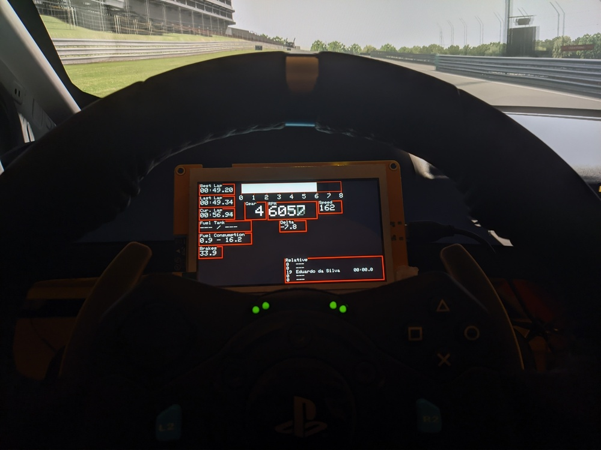
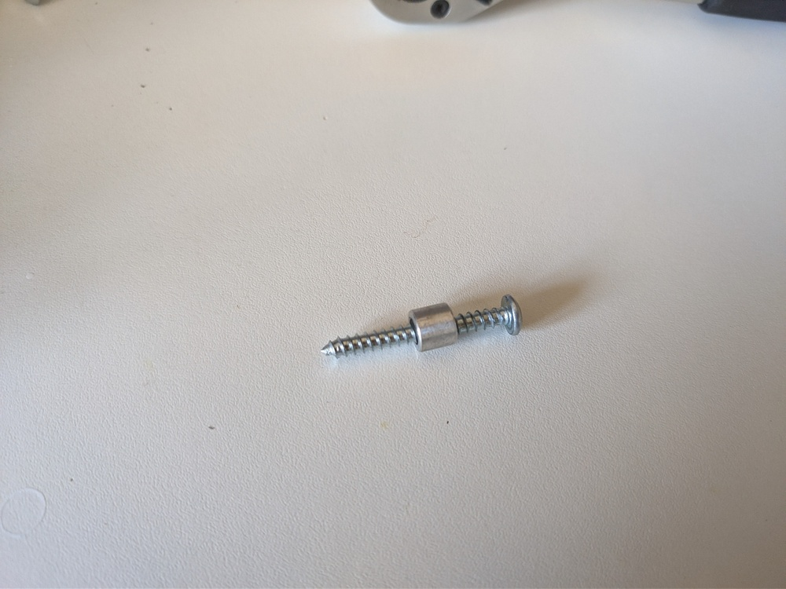
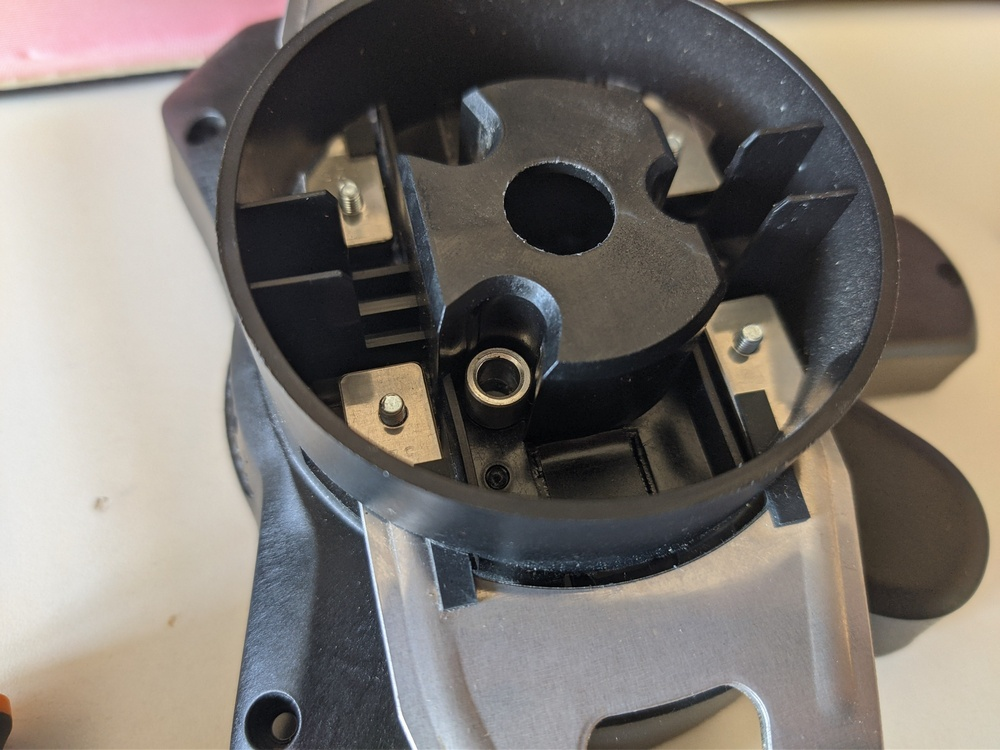

# CDashDisplay
The 'C' is for Cheap.

This project uses a cheap yellow display (ESP32-8048S043) as its foundation. It
can be acquired for round 30-40€ on Aliexpress, for example.

Currently I have a way to mount it on a G29 because its what I have.

To drive it I one of my other projects: [ESDI](https://github.com/ESilva15/ESDI)



## Assembly
It requires a very simple modification to the G29. The display will seet between
the base and the steering wheel and for the stock G29 paddles to remain functional,
the steering wheel must be spaced.

I used simple spacers that I had laying around with OD≃8mm and ID≃5mm. They will
go on the screws that screw the wheel to the base:



# Roadmap
- [ ] Better layout tooling
- [ ] Dynamic layout/data


### Debugging wires
RX 18 -> yellow -> green
TX 19 -> blue -> white

### Cool fonts I like:
- u8g2_font_bubble_tr (really cool for splash screens)
- u8g2_font_helvR10_tr (very readable, should really try this one)
- u8g2_font_6x12_tf (monospace)

### Weird font rendering stuff going on
When the cursor is set to a position, the text will actually render
from the left bottom corner, so 0,0 will actually render text that
can't be viewed.
Solution, for now:
```cpp
U8G2 u8g2;
u8g2.setFont(u8g2_font_9x18_tf);
int ascent = u8g2.getAscent();
// will probably vary from font to font tho, right now I'm using
// monospace and that's enough
```
